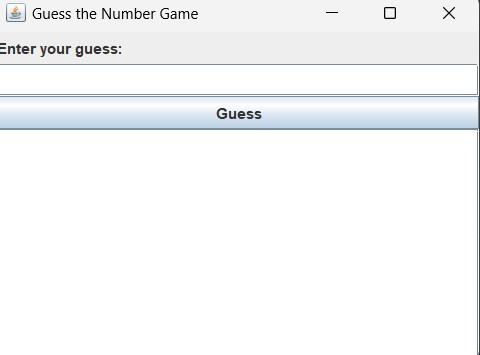
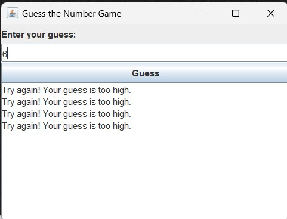
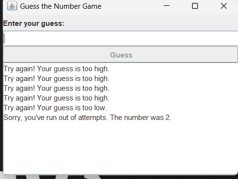

<h1>Guess the number</h1>

<h3><b>Overview</b></h3>

The "Guess the Number" game is a fun and easy Java project that allows the user to guess a number generated by the computer. 
The game includes features such as limiting the number of attempts, multiple rounds, and scoring based on the number of attempts.

<h3>Features</h3>

- The system generates a random number from a given range (1 to 100).
- The user is prompted to enter their guess in a dialogue box.
- The computer provides feedback if the entered number matches the generated number, or if it is higher/lower.
- The game continues until the user guesses the number or runs out of attempts.
- Multiple rounds can be played.
- A scoring system gives points based on the number of attempts.

<h3>How to Play</h3>

1. Run the game.
2. A random number between 1 and 100 will be generated.
3. Enter your guess in the dialogue box.
4. The game will tell you if your guess is too high, too low, or correct.
5. Continue guessing until you get the correct number or run out of attempts.
6. The game will then display your score and ask if you want to play another round.

<h3>Installation and Running the Game</h3>

 Prerequisites
- Java Development Kit (JDK) installed on your machine.

<h3> Steps</h3>

1. Clone the repository:
    ```bash
    git clone https://github.com/yourusername/guess-the-number.git
    ```
2. Navigate to the project directory:
    ```bash
    cd guess-the-number
    ```
3. Compile the Java file:
    ```bash
    javac GuessTheNumberGUI.java
    ```
4. Run the game:
    ```bash
    java GuessTheNumberGUI
    ```

Preview

<h3>1.PREVIEW OF INTERFACE</h3>
<center></center>
<br>
<h3>2.PREVIEW OF GUESSING</h3> 
<center>></center>
<br>
<h3>3.MAX ATTEMPTS REACHED</h3>
<center></center>
<br>

    
